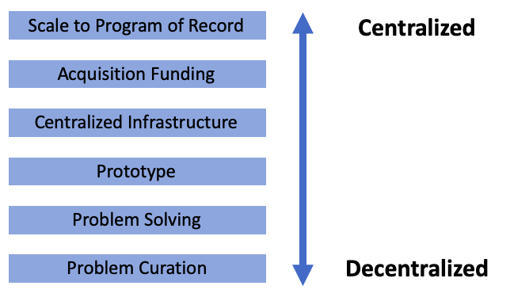

  
# Welcome to the Data Science Cookbook!
 
A resource to help data scientists go from **problem to prototype**  

-----------------------------------------------

 
_Author's note: This is still a work in progress..._
_We have tried our best to attribute all links and work. If we have failed to do so, or you wish for something to be removed, please let us know!_
    

## What is this?
An open-source “cookbook” to enable bottom-up data science in DoD units at the edge of the formation. Help small teams get from 0 → 1.
    

## How do I use this cookbook?
Like any cookbook, flip to the recipe you need. We tried to make each subsection stand on its own and be consumable on its own. If you don’t understand a particular ingredient in the recipe, use the ingredients section to learn more.

**Use the [_ingredients_](/ingredients) and [_recipes_](/recipes) links here or the navigation bar at the top of this page**
    

## Why did you make this?
Enablers of ML in DoD—infrastructure, funding, acquisition—are centralized.
Problems, problem solving, and prototyping—are decentralized.
  

**Purpose: merge top-down enablers with bottom-up problem solving**

  

 
Source: Made by Authors

  
## How does it work?
- _"Ingredients"_ → What goes in to the recipes (human capital, development environment, compute, data)
- _"Recipes"_ → Process. (defining the problem, data management, exploring data, building models, etc)
- Structure → bite-sized (<5 pg) articles
    

## Team
Data scientists, designers, and product managers with experience in DoD (AI Task Force, Maven, Kessel Run, Fort Meade, SOCOM, Harbinger and more)
    

## Audience
Operations Research Analysts, junior data analysts, data sciewntists, recent graduates of universities and grad school programs, bootcamp grads, product managers.
    

## Where do I go from here?
- **Show me the [_ingredients_](/ingredients)**
- **Take me to the [_recipes_](/recipes)**

    
#### Caveats
_These views and ideas are the authors' own and do not represent the views of the DoD, the Services, or any DoD organizations_
